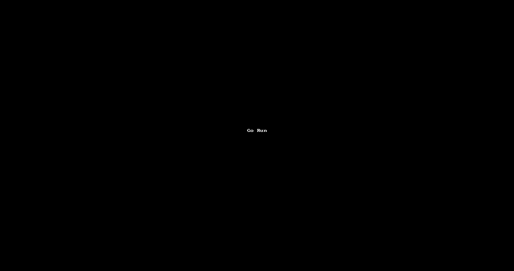

# Go Fun
Experiments and Fun Go Lang and Frameworks. Also includes tools like docker, k8, istio and perf (wrk)

## Build
Use goreleaser for build test. [Install](https://goreleaser.com/install/) if not already installed

goreleaser build --snapshot --rm-dist
goreleaser release --snapshot --skip-publish --rm-dist

## Testing
Testing is handled via [Ginkgo](https://github.com/onsi/ginkgo). To run all unit tests excluding ones require external setup.

`ginkgo -r '--label-filter=!setup' .`

## FunApp
Sample Funapp which is rest based app with various tools and tests required as sample.

By default it runs without any dependencies with in memory [sqlite3](https://github.com/mattn/go-sqlite3) database which can be configured via ENV Variables.

------
### Direct Run
`go run ./components/fun-app/` 

  

### Vscode Run
* Checkout Code
* Run FunApp Test Configuration
* Configure [ENV](components/fun-app/.env) if required

  

### Docker Run
`docker run amanfdk/fun-app`
 
[Docker Hub](https://hub.docker.com/r/amanfdk/fun-app)

### K8/Istio Run
- Setup K8/Istio Cluster

- Setup Using: `./components/fun-app/helm-charts/setup.sh`

- Clenup Using: `./components/fun-app/helm-charts/clean.sh`

Install via Helm Coming Soon ...

## TODO
- Message Queue
- Traces
- Swagger