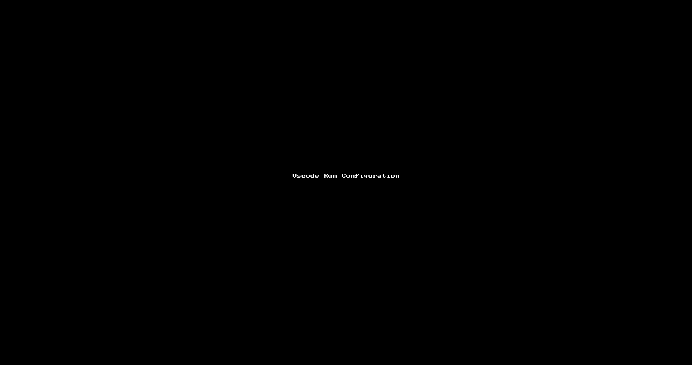
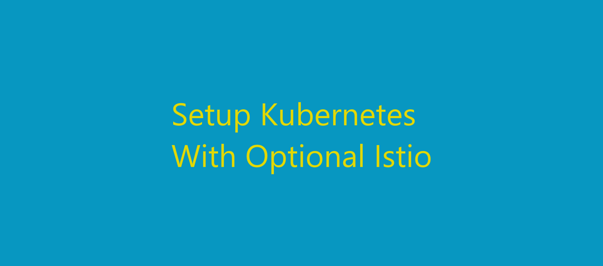
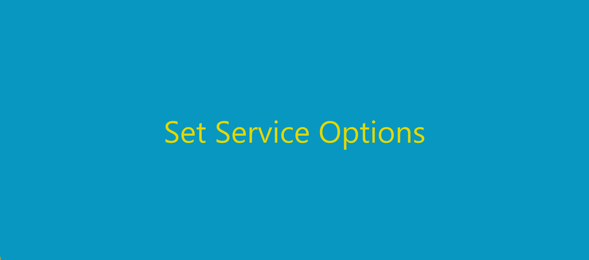

[](https://github.com/amanhigh/go-fun/actions?workflow=build)
[](https://codecov.io/gh/amanhigh/go-fun)
[](https://github.com/amanhigh/go-fun/releases)

[](https://github.com/amanhigh/go-fun/issues)
[](https://github.com/amanhigh/go-fun/pulls)
[](https://goreportcard.com/report/github.com/amanhigh/go-fun)

# Go Fun
This repository follows the philosophy of Learning by Doing. It includes plays, experiments with Golang and its frameworks to learn. Later Kubernetes including Docker, Istio (Service Mesh), Performance testing is also included.  
- ## FunApp
	FunApp is a Sample Rest App which tries to use various golang Frameworks commonly required. It tries to follow good practices and standards. It runs without any dependencies with in memory [sqlite3](https://github.com/mattn/go-sqlite3) database by default.  
	- ### Play
		Easy ways to Play with **FunApp** without Dev Setup.  
		- Start
			- Golang: `go run ./components/fun-app/`
				  
			- Docker [Image](https://hub.docker.com/r/amanfdk/fun-app): `docker run amanfdk/fun-app`
		- Testing
			- Unit and Integration Testing is done via [Ginkgo](https://github.com/onsi/ginkgo).
			- Run Tests: `ginkgo -r '--label-filter=!setup' .` (Excludes that require separate setup.)
		- Performance Test
			[Vegeta](https://github.com/tsenart/vegeta) is the tool of choice here. [Gum](https://github.com/charmbracelet/gum) helps in prompts.  
			- Installation: `brew install gum vegeta`
			- Run: `cd ./components/fun-app/it/;./load.sh`
	- ### Dev Setup
		This section guides on setup for Development Setup for this Repository. We are using Vscode and Kubernetes  for this example.  
		- ### Vscode
			- Use Command Palatte and run application using `> Select and Start Debugging` and then Select `FunApp`
			- Change [ENV](components/fun-app/.env) to override default Configuration.
			- 
		- ### Kubernetes Cluster
			- Below Section requires running Kubernetes Cluster and Helm CLI. Charts can be used from local or from Github.
			- Via Github
				- Setup
					```
					helm repo add go-fun https://amanhigh.github.io/go-fun
					helm install -n fun-app fun-app go-fun/fun-app
					```
				- Cleanup: `helm -n fun-app delete fun-app`
			- Via Local
				- Setup: `go-fun/components/fun-app/charts/setup.sh`
				- Clean: `go-fun/components/fun-app/charts/clean.sh`
			- Open: http://localhost:9000/metrics  (Tunnel required for forwarding:  `minikube tunnel`)
			- 
		- ### Development Container
			- Development help you live debug an application in K8 Cluster.
			- *Helm Setup (Prev Step)* is prerequisite to run Development Remote Container.
			- It is configured to Auto Reload Code Changes
			- Try:
				- Run `devspace -n fun-app dev`
				- Open http://localhost:8080/metrics
				- Cleanup: `devspace -n fun-app purge`
				- Override Vars:  `devspace list vars --var DB="mysql-primary",RATE_LIMIT=-1`
			- 
		- ### Perf Test
			- Showcases how to do Performance Testing. Requires Load Test Container to be Setup. Refer `Tools > Kubernetes > Services` below.
			- Load Test (From Vegeta Container):  `echo 'GET http://app:8080/person/all' | vegeta attack | vegeta report`
			- Log Analyzer : `kubectl -n fun-app logs `kubectl get pods -n fun-app -o name | grep app | head  -1` --since=1m -f | goaccess --log-format='%^ %d - %t | %s | %~%D | %b | %~%h | %^ | %m %U' --date-format='%Y/%m/%d' --time-format '%H:%M:%S'`
- ## Tools
	- ## Kubernetes
		To ease development and easy setup of dependencies we use Kubernetes. Also [K9S](https://github.com/derailed/k9s) provides easy interface to manage containers, see logs etc. [Helms](https://github.com/helm/helm) are used to setup various services which application can depend on.  
		- ### Minikube
			- To setup kubernetes there are multiple options available like minikube, kind, k89, k3s etc. In this project we are using [minikube](https://minikube.sigs.k8s.io/docs/).
			- This will also setup [traifik](https://github.com/traefik/traefik) ingress for easy access.
				- User needs to give sudo for port 80 forward.
				- Setup DNS Mapping by adding following line to `/etc/hosts`
					```
					127.0.0.1 docker httpbin.docker dashy.docker resty.docker app.docker mysqladmin.docker redisadmin.docker prometheus.docker grafana.docker jaeger.docker kiali.docker ldapadmin.docker webssh.docker webssh2.docker sshwifty.docker nginx.docker portainer.docker consul.docker opa.docker sonar.docker
					```
			- Script and Multiselect can be used to enable Istio, Backup, Restore etc.
				- Setup - `./go-fun/Kubernetes/mini.zsh MINIKUBE`
				- Teardown - `./go-fun/Kubernetes/mini.zsh CLEAN`
				- MultiSelect - `./go-fun/Kubernetes/mini.zsh`
			- 
		- ### Services
			- Package has multiple service which can be setup on top of Minikube. This helps in easy setup of complex dependencies like Mysql Cluster, Load Testing, Mongo, Prometheus, Sonar and many more ...
			- Service Script allows you multiple flags to set, create and teardown the setup.
			- Flags (Multiple flags can be passed together)
				- Basic
					- Set (s) - Allows you set Service Reciepe.
					- Install (i) - Installs Helms
					- Delete (d) - Deletes & Clears all Helms (Excludes Bootstrapped Services)
				- Advanced
					- Reset (b) - Bootstraps Traefik and Dashy
					- Reset (r) - Nukes all Resources in Current Namespace & Helms including Bootstrapped.
				- Examples
					- Set & Install - `./go-fun/Kubernetes/services/services.zsh -si`
					- Destroy & Install - `./go-fun/Kubernetes/services/services.zsh -di` (Needs Set to be already done)
			- 
	- ### Log Analyzer
		- Monitor Logs via [GoAccess](https://github.com/allinurl/goaccess)
			- Terminal Access: `go run main.go | goaccess --log-format='%^ %d - %t | %s | %~%D | %b | %~%h | %^ | %m %U' --date-format='%Y/%m/%d' --time-format '%H:%M:%S'`
			- Web Access
				- Add Flags to Above Command `-o report.html --real-time-html`.
				- Open report.html in Browser and it should auto refresh.
		- **Useful Fields**
			- Mandatory Fields: %d (Date), %h (Host), %r/%m %U (Request)
			- Skip: Ignore (%^) , Skip Space (%~)
			- DateTime: (%x/--datetime-format) OR Time (%t/--date-format) + Date (%d/--time-format)
			- Host: IP (%h) OR Virtual Host (%v)
			- Request: Full With Quotes (%r) or Method (%m), URL (%U), Query (%q), PROTOCOL (%H),
			- Response: Status Code (%s), Size (%b)
			- Latency: MicroSecond (%D), MilliSecond.MicroSecond (%T), MilliSecond With Decimal (%L)
			- User Info: User-Agent (%u), Referrer (%R)
		- **Custom Log Monitoring**
			- Custom Logs require configuring various flags.
			- Identify [Date and Time Format](https://www.freebsd.org/cgi/man.cgi?query=strftime&sektion=3).
				- Configured via flag `--date-format` and `--time-format`
				- Verify Format, bash run: `date '+%Y/%m/%d - %H:%M:%S'` for output `2023/01/23 - 14:38:2`
			- Identify [Log Format](https://goaccess.io/man#custom-log)
				- Configured via flag `--log-format`
				- Start with initial fields and progress further for easy debug.
			- Debug Mode: `-l debug.log`
		-
- ## Golang
	This section covers common practices and tools for Golang.  
	- ### Module Management
		This is multi module project. Each module has its own go mod file. Modules can be managed using [semver](https://semver.org/) tags. Eg. v1.0.0  
		- Sync Modules using `go work sync` in go.work directory. This is automatically done before builds.
		- Mod
			- New Module run `go mod init github.com/amanhigh/go-fun/components/fun-app` and to work using `go work use ./components/fun-app`
			- Link Module to new Release using `go mod tidy` or `go get -u github.com/amanhigh/go-fun/models`
			- Recursive Depdency Update `find . -name "go.mod" -execdir sh -c 'go get -u && go mod tidy';`. Run it in ProjectBase Dir
		- Tags
			- See existing tags. `git tag | grep common`
			- Tag New Release. `git tag common/v1.0.0` followed by `git push --tags`
			- Remove Release involves deleting Tag with `git push --delete origin common/v1.0.0`
	- ### Release Management
		Release management includes  build and release of Artifacts like binaries, dockers etc. This Project uses [Goreleaser](https://goreleaser.com/install/).  
		- Build Only - `goreleaser build --snapshot --clean`
		- Prepare Release - `goreleaser release --snapshot --skip-publish --clean`
		- Release - `goreleaser release --clean`
		- Configs
			- Override Tags: Optional Override of Release Tags can be Done.
				- Previous:  `export GORELEASER_PREVIOUS_TAG=v1.0.1`
				- Current:  `export GORELEASER_CURRENT_TAG=v1.0.2`
			- [Generate Token](https://github.com/settings/tokens/new) (Repo Scope) and load into env Variable. Eg. `env | grep GITHUB_TOKEN`